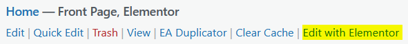

# How to install Google reCAPTCHA on Elementor Pro for WordPress

Berfore starting this tutorial, let's understand what really is a CAPTCHA. It stands for Completely Automated Public Turing test to tell Computers and Humans Apart. This can sounds confusing but in short terms it is to distinguish humans from robots.

This technology is used, or should be used, in every websites. You can attach this technology to a form, such as a contact form or a login form in order to prevent robots abuse those forms. They could be using those to spam your email account or even to crash your website by creating tons of users.

Concretely, CAPTCHA asks the user to do an action that only humans can accomplish, such as finding boats on different images, moving a puzzle piece to its right place, etc. Here is an exemple :

||
|:--:|
|*Figure 1 : Simple exemple of what a CAPTCHA is.*|

## Google reCAPTCHA

There are many companies proposing this kind of service. However, the most known of them is ... **Google** you guessed it.

Google provides a **free** CAPTCHA service which is called **reCAPTCHA**.

Actually, it's a freenium but you can get up to **1 million CAPTCHA / month** with the free version.

### Versions

#### reCAPTCHA v2

There is two main versions of the service. The first one is the one that you saw in *Fig. 1*, showing up to the user a pop up that asks to click on squares that contains a certain object. This is maybe the only version of CAPTCHA you know about, but there is another one that acts hidden.

#### reCAPTCHA v3

Indeed, the v3 of Google reCAPTCHA doesn't require any action from the user. Here is the description on reCAPTCHA v3, from Google themselves :

> reCAPTCHA v3 returns a score for each request without user friction.
>
> The score is based on interactions with your site and enables you to take an appropriate action for your site.
>
> *[reCAPTCHA v3 | Google Developers](https://developers.google.com/recaptcha/docs/v3)*

This version can be detected with a little reCAPTCHA badge that is usually on left or right bottom side of websites.

||
|:--:|
|*Figure 2 : reCAPTCHA v3 badge exemple.*|

In this tutorial on how to install Google reCAPTCHA on Elementor Pro for WordPress, we'll see how to install both of those two versions.

### Create Google reCAPTCHA account

The first thing you need to do, is to create an account on the Google service.

Go to that address : [reCAPTCHA Create Account](https://www.google.com/recaptcha/admin/create) and connect to your Gmail account.

Then you'll end up with that page for registering a website :

||
|:--:|
|*Figure 3 : Page 1/2 for registering a website to Google reCAPTCHA.*|

Here there is few steps :

1. Enter a name for the reCAPTCHA account, you can put the name of your website (e.g. *example.com*)
2. Select the version of reCAPTCHA (*v2 if you want user interaction, v3 if not*)
3. Enter you website's domaine (e.g. *example.com*)

If you scroll down a bit, there is more settings.

||
|:--:|
|*Figure 4 : Page 2/2 for registering a website to Google reCAPTCHA.*|

1. You can see here that I've added the domain **example.com** to the reCAPTCHA account.
2. Here is the collaborators (= people who can manage the reCAPTCHA account). You can add you collaborator's emails.
3. You must accept the terms of use of Google reCAPTCHA. The second box is optional, for sending emails in case of CAPTCHA problems.
4. Finally, click on **SEND** and boom! Your Google reCAPTCHA account is now created! 😊

### Saving the access keys

After registering your first website to Google reCAPTCHA, you'll be shown two **essentials information**.

1. Public reCAPTCHA key
2. Private reCAPTCHA key

||
|:--:|
|*Figure 5 : Public and private Google reCAPTCHA keys.*|

Those information will be used later on Elementor's WordPress plugin settings. You should save the keys somewhere, but if you cannot, this is not a problem because you can recover them afterward by going on your reCAPTCHA account.

## Configure Elementor Pro to use your reCAPTCHA account

For this, we will go on our WordPress Admin Dashboard, and go to the Elementor Pro's settings.

||
|:--:|
|*Figure 6 : Public and private Google reCAPTCHA keys.*|

Next, go to the **Integration** tab.

On that tab, you'll fill the keys that was created by Google reCAPTCHA service.

||
|:--:|
|*Figure 7 : Elementor Pro Integration tab and reCAPTCHA configuration.*|

Depending on the version of reCAPTCHA you've created you account with, you might be choosing the first or the second section.

As I've already created two types of Google reCAPTCHA, I will fill the two sections. But in your case, you might just want to use one specific version.

||
|:--:|
|*Figure 8 : reCAPTCHA configuration v2 and v3.*|

Then you can click on **Save Changes** on the bottom of the page and your settings will be applied to Elementor!

## Use the reCAPTCHA into Elementor forms

The final step for this tutorial is to add our newly configurated reCAPTCHA service to some forms.

In order to do that, go to your WordPress pages and click on **Edit with Elementor** on one Elementor page containing a form.

||
|:--:|
|*Figure 9 : WordPress page edit with elementor.*|

Once the Elementor builder plugin is done loading, you can select a form by clicking on it or with the element navigator on the right side, and edit its items.

||
|:--:|
|*Figure 10 : Select your form and add an item.*|

Then on the left side, there is the Elementor form editor. Under **Form Feilds**, click on **Add item**. You'll need to select the type of the item that you've just added.

If you created a reCAPTCHA v2 account, then just select reCAPTCHA; else, if it's a reCAPTCHA v3 account, then select reCAPTCHA v3.

Finally, click on the Elementor's save button and you're done with reCAPTCHA!

||
|:--:|
|*Figure 11 : Select the reCAPTCHA version and save.*|

Good Job! 🥳

## Final result

Now, if you visit the page where you added your reCAPTCHA form, you can see the badge or the checkbox depeding on the version!
||
|:--:|
|*Figure 12 : Exemple for with reCAPTCHA v2 activated.*|

## Creds

Author : [Maxence ZOLNIERUCK](https://www.linkedin.com/in/maxence-zol/)

Write date : April 24th, 2022

**Technologies used:**

- 
- 
